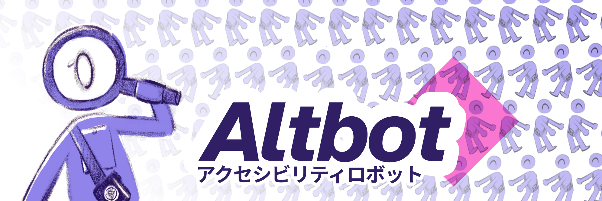

<div align="center">
  

  # AltBot アクセシビリティロボット
  
  *Making the Fediverse more inclusive, one image at a time*

  [](https://github.com/micr0-dev/AltBot/releases)
  [](https://fuzzies.wtf/@altbot)
  [](https://owl-license.org/)
  [](https://go.dev/)
  
  
</div>

## About

AltBot is an open-source accessibility bot designed to enhance the Fediverse by generating alt-text descriptions for images, video, and audio. This helps make content more accessible to users with visual impairments.

## How It Works

AltBot listens for mentions and follows on Mastodon. When it detects a mention or a new post from a followed user, it checks for images without alt-text. If it finds any, it uses a Large Language Model (LLM) to generate descriptive alt-text and replies with the generated text.

### Features

- **Mention-Based Alt-Text Generation:** Mention @AltBot in a reply to any post containing an image, video, or audio, and AltBot will generate an alt-text description for it.
- **Automatic Alt-Text for Followers:** Follow @AltBot, and it will monitor your posts. If you post an image, video, or audio without alt-text, AltBot will automatically generate one for you.
- **Local LLM Support:** Use local LLMs via Ollama for generating alt-text descriptions.
- **Consent Requests:** Ask for consent from the original poster before generating alt-text when mentioned by non-OP users.
- **Configurable Settings:** Easily configure the bot using a TOML file.

## Privacy Note

Your post content is never used. Only images without existing alt-text will be processed.

## Disclaimer

Alt-texts are generated using a Large Language Model (LLM). While we strive for accuracy, results may sometimes be factually incorrect. Always double-check the alt-text before using it.

## Setup

1. Clone the repository:
    ```sh
    git clone https://github.com/micr0-dev/AltBot.git
    cd AltBot
    ```

2. Run it:
    ```sh
    go run main.go
    ```

    The setup wizard will guide you through configuring the essential values required for the bot, including:
    - Your Mastodon server URL, client secret, access token, and bot username.
    - The admin contact handle for shadow ban notifications.
    - Enabling optional features like metrics and alt-text reminders.
    
    Alternatively, copy the example configuration file and edit it manually:
    ```sh
    cp example.config.toml config.toml
    ```

3. Run the bot:
    ```sh
    go run main.go
    ```

## Contributing

We welcome contributions! Please open an issue or submit a pull request with your improvements.

## License

This project is licensed under the [OVERWORKED LICENSE (OWL) v1.0.](https://owl-license.org/) See the [LICENSE](LICENSE) file for details.

---

Join us in making the Fediverse a more inclusive place for everyone!
